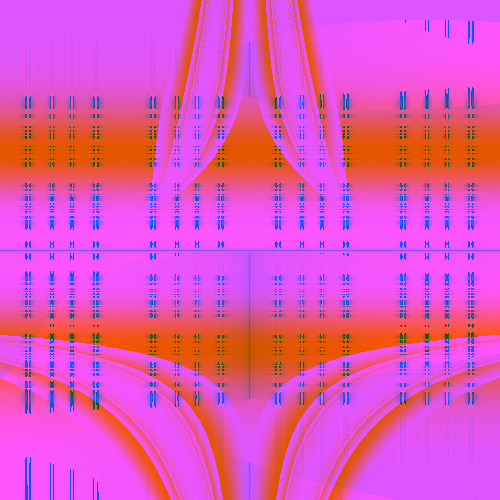
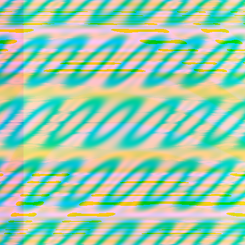

# Random art with math expressions

> A Python script that generates random Math expressions which are then used to create images.

---


Math Expressions for above image

_red:_

```
level(quotient(0.47893459814214656, -1), level(pow((sqrt(0.8111184439305582) + pow(0.1293034349987755))), c_sin(tip(mix(x, 0, 0))), c_sin(c_pi() * c_sin(2 * c_pi() * y * c_pi())), 0.39430322500098836), quotient(modulo(avg(0, -1), ((c_cos(2 * c_pi() * 1) + parabola(0.018360091138764578)) + 0)), c_sin(c_pi() * mix(dip(avg((0.8000314862185645 + pow(y)), quotient(y, x))), sqrt(parabola(x) * c_pi()), (parabola(c_sin(level(0, 0, 0, 0.5767384303973336))) + modulo(c_cos(2 * c_pi() * c_cos(2 * c_pi() * y)), 0))))), 0.5519140513296844)
```

_green:_

```
quotient(mix(c_cos(c_pi() * avg(0.9460962385098135, parabola(c_sin(2 * c_pi() * -1)))), mix(tip(mix((y * c_pi() * c_sin(2 * c_pi() * tip(1))), parabola(parabola(0.3200829909150611)), dip(-1))), (0.5041958715722334 * parabola(sqrt(0))), sqrt(parabola(c_cos(c_pi() * mix((1 * 0.960317037248831), y, -1))))), mix(c_sin(2 * c_pi() * x), (pow(-1) + tip(mix(y, (y + 0), 0.08620560185196768))), parabola(tip(-1)))), modulo(c_cos(c_pi() * c_cos(c_pi() * dip(0))), c_sin((sqrt(y) * c_sin(c_cos(c_pi() * level(-1, 1, -1, 0.001580630934213234)))))))
```

_blue:_

```
mix((c_sin(avg(c_sin(1), c_sin(2 * c_pi() * c_sin(c_pi() * y)))) * x), pow(c_cos(2 * c_pi() * x)), quotient(c_sin(c_sin(2 * c_pi() * 0.5599369560473466) * c_pi()), c_sin(c_pi() * c_cos(c_cos(c_sin(0.0032596001697566823)))))) * c_pi()
```

### A few example images:

     

    

## Setup

Install numpy and Pillow:

`$ pip install -r requirements.txt`


(Optional) Compile Cython files:

`$ python setup.py build_ext --inplace`

---

## Usage (Optional)

This will create the example pictures above

`python main.py --size 100 --path ./demo_expr.txt`


This will create 10 new random pictures

`python main.py --size 150 --num 10`

```
usage: main.py [-h] [--num Number of images] [--prob Probability]
               [--size Size of image] [--path Expression file path]

Creates random art

optional arguments:
  -h, --help            show this help message and exit
  --num Number of images
  --prob Probability
  --size Size of image
  --path Expression file path
```

---
